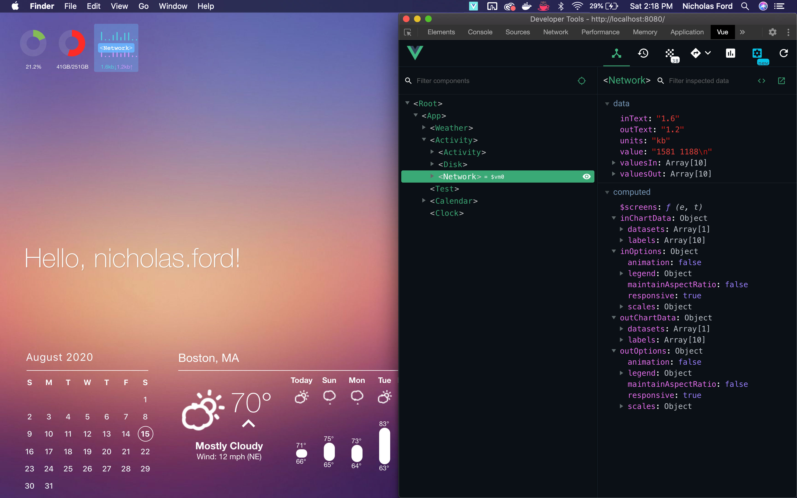

# Vuebersicht

Inspired by [Üebersicht](https://github.com/felixhageloh/uebersicht), built with Vue, Electron, & TypeScript.

Add custom widgets to your desktop background, built as Vue single-file components, either in TypeScript or JavaScript.


Comes with an Üebersicht-like menu



...and Chromium / Vue Dev Tools

## Widgets

Widgets are automatically imported from the `./src/widgets` directory, each widget should follow the file naming convention of `<foo>.widget.vue`. You may construct widgets using multiple Vue components, just make sure the root component of the widget has a filename ending in `.widget.vue`, and child components do not.

## Utilities

### run(command)
  - Decription: Run a shell command.
  - Params: `command: string`
  - Returns: `Promise<stdout|stderr>`

example:

```js
import { run } from '@/utils'

...
  try {
    const stdout = await run('ls -la')
    console.log(stdout)
  } catch(e) {
    throw e
  }
```

### sleep(milliseconds)
  - Description: Wait for an aribitrary amount of time
  - Params: `milliseconds: number`
  - Returns: `Promise<void>`

example:

```js
import { sleep } from '@/utils'

...
  await sleep(1000) // wait for 1 sec
  foo()
```

## Limitations

This is still just experimental. Because of the nature of nature of the current build tooling, I haven't yet found a way to enable some important features of the original [Üebersicht](https://github.com/felixhageloh/uebersicht) application, hot-reloading in production builds, for instance. For now, it is recommended to run this experimental application in development mode.

## Project setup

```bash
yarn install # or npm install
```

### API keys

Vuebersicht currently ships with a Weather widget that uses 2 APIs, Google Geocoder API (for getting your approximate location), and Darksky API (to get local weather data for that location). You'll need to create these API keys and add them to an untracked file called `.env.local`, in the root directory of the project.

```js
GOOGLE_API_KEY = "<google geocoder api key>"
DARKSKY_API_KEY = "<darksky api key>"
```

- [Create a Google Geocoder API key](https://developers.google.com/maps/documentation/geocoding/get-api-key)
- ~~[Create a DarkSky API key](https://darksky.net/dev/register)~~

Note: Since Apple's aquisition of DarkSky, they are no longer allowing creation of API keys. An alternative API will most likely be required here.

### Start the application

```bash
yarn serve # or npm run serve
```

<!-- ### Production build

```bash
yarn build
```

### Run unit tests

```bash
yarn test:unit
``` -->

### Lints and fixes files

```bash
yarn lint # or npm run lint
```

#### Thanks

Major shoutout to [@felixhageloh](https://github.com/felixhageloh) for his amazing work on [Üebersicht](https://github.com/felixhageloh/uebersicht), which is an incredible project that I find both inspiring and humbling. Vuebersicht is in no way meant to be a competitor or a replacement for Üebersicht, if anything it is intended to be a modest tribute to the original, an experimental toy project.

Core libraries used to make this possible:

- [TypeScript](https://github.com/microsoft/TypeScript)
- [Electron](https://github.com/electron/electron)
- [Vue.js](https://github.com/vuejs/vue)
- [Webpack](https://github.com/webpack/webpack)

And others used to build some of the widgets:

- [chart.js](https://github.com/chartjs/Chart.js)
- [v-calendar](https://github.com/nathanreyes/v-calendar)
- [vue-weather-widget](https://github.com/dipu-bd/vue-weather-widget)
